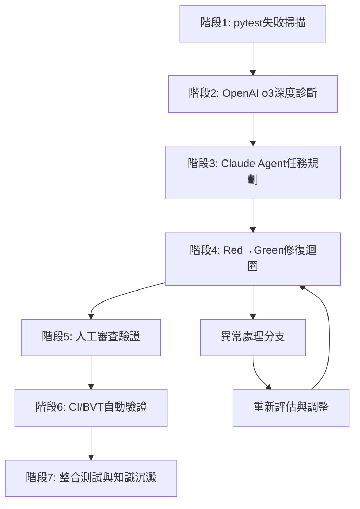

# 完整AI除錯流程工序方案

基於前述討論和軟件測試最佳實踐，本文提供一個針對Python + pytest專案的完整AI除錯流程。此流程結合了OpenAI o3的深度分析能力與Claude 4 Sonnet的Agent執行功能，旨在將大量失敗的單元測試在一天內收斂至全綠狀態。

## 流程架構總覽



此流程設計遵循軟件測試的分層原則，從單元測試開始，逐步擴展到BVT和整合測試，確保每個階段都有明確的品質閘門和回滾機制。

## 階段一：pytest失敗掃描與資料收集

這個階段的核心目標是系統性地收集並標準化所有測試失敗資訊，為後續的AI分析提供完整且結構化的資料基礎。我們採用pytest的內建功能來產生詳細的失敗報告，這些報告將成為整個除錯流程的起點。

首先執行comprehensive pytest掃描，使用以下指令來產生詳細的失敗報告：
```bash
pytest -v --tb=long --json-report --json-report-file=failures.json --continue-on-collection-errors
```

這個指令的參數設計具有特定意義：`-v`參數提供詳細輸出，讓我們能夠看到每個測試的完整路徑；`--tb=long`確保我們獲得完整的traceback資訊，這對於根本原因分析至關重要；`--json-report`功能將結果輸出為機器可讀的JSON格式，便於後續的AI處理；`--continue-on-collection-errors`參數確保即使在測試收集階段遇到錯誤，pytest仍會繼續執行其他可用的測試。

同時，我們需要收集環境資訊和相關的系統狀態。這包括Python版本、套件依賴版本、環境變數設定，以及任何可能影響測試執行的外部因素。建議建立一個環境快照腳本：
```bash
pip freeze > requirements_snapshot.txt
python --version > python_version.txt
env | grep -E "(PATH|PYTHONPATH|DATABASE|API)" > env_snapshot.txt
```

收集到的資料應該包含失敗測試的完整路徑、錯誤訊息、堆疊追蹤、測試執行時間，以及任何相關的日誌輸出。這個階段的產物是一個comprehensive的`failures.json`檔案，它將作為下個階段AI分析的輸入資料。

## 階段二：OpenAI o3深度診斷與分析

在這個階段，我們利用OpenAI o3的強大推理能力對收集到的錯誤資料進行深度分析。o3模型具備87.7%的科學推理能力和71.7%的軟體工程能力，特別適合進行複雜的根本原因分析和系統性問題診斷。

### 專業Prompt（o3深度診斷）

```markdown
# 系統角色設定
你是一位擁有15年經驗的Python軟體架構師和測試專家，專精於pytest測試框架和複雜系統問題診斷。你具備深度的技術洞察力和系統性思維能力。

# 任務說明
對以下pytest失敗報告進行全面的根本原因分析，運用軟體工程最佳實踐提供系統性診斷。

# 輸入資料
[貼入failures.json的內容]

# 分析框架
請運用以下方法論進行分析：

## 1. 錯誤模式識別
依據stack trace的共同特徵將失敗測試分為3-5個群組，每組應有明確的共同根因。對每個群組進行：
- 錯誤模式描述
- 受影響的模組和檔案
- 失敗測試數量統計
- 初步根因假設

## 2. 5Why深度分析
對每個錯誤群組進行5Why分析：
- Why 1: 直接的技術錯誤是什麼？
- Why 2: 為什麼會出現這個技術錯誤？
- Why 3: 為什麼沒有預防這種情況？
- Why 4: 為什麼現有的測試或設計沒有捕捉到這個問題？
- Why 5: 為什麼系統架構允許這種問題發生？

## 3. 影響評估矩陣
對每個群組評估：
- 業務影響程度 (Critical/High/Medium/Low)
- 修復複雜度 (Simple/Medium/Complex/Architectural)
- 修復時間估算 (小時為單位)
- 迴歸風險評估 (High/Medium/Low)

# 輸出格式要求

請產出結構化的Markdown報告，包含以下sections：

## 執行摘要
- 總失敗測試數量
- 主要錯誤群組數量
- 整體修復時間估算
- 建議修復順序

## 錯誤群組詳細分析
### Group A: [群組名稱]
- **根本原因**: [基於5Why分析的深層原因]
- **技術細節**: [具體的程式碼問題和相關檔案]
- **修復策略**: [具體的修復方法和步驟]
- **受影響測試**: [具體的測試檔案和函數列表]
- **預估工時**: [X小時]
- **優先級**: [P0/P1/P2/P3]
- **迴歸風險**: [具體的風險評估]

## 修復建議
### 立即修復 (P0)
[需要立即處理的關鍵問題]

### 優先修復 (P1)
[重要但非緊急的問題]

### 計劃修復 (P2/P3)
[可以延後處理的問題]

## 預防措施
- 程式碼規範建議
- 測試策略改進
- CI/CD流程優化
- 架構設計建議

# 專業要求
- 使用精確的Python和pytest術語
- 提供可執行的具體修復步驟
- 考慮修復的系統性影響
- 基於實際經驗提供時間估算
```

這個階段的輸出是一個comprehensive的`error_analysis.md`檔案，它包含了所有錯誤的系統性分析、優先級排序和具體的修復建議。這個分析報告將成為下一階段Agent執行的藍圖。

## 階段三：Claude 4 Sonnet Agent任務規劃與執行

Claude 4 Sonnet在Agent模式下具備72.7%的SWE-bench Verified成績，特別擅長程式碼理解和修改任務。在這個階段，我們將o3的分析結果轉化為可執行的任務清單，並由Claude Agent進行自動化修復。

### 專業Prompt（Claude Agent控制）

```markdown
# 系統角色設定
你是一位專業的Python除錯Agent，具備自主決策能力和任務管理能力。你需要根據error_analysis.md的內容創建和執行結構化的修復任務。

# 任務說明
1. 解析error_analysis.md中的所有錯誤群組
2. 創建優先級排序的To-Do List
3. 逐一執行修復任務
4. 維護任務狀態和進度追蹤
5. 確保每個修復都經過充分測試

# 執行框架

## To-Do List 結構
請為每個錯誤群組創建以下格式的任務：

```
# AI除錯任務清單

## 🔥 Critical Tasks (P0)
- [ ] [Group-A] 修復登入驗證邏輯錯誤
  - **檔案**: auth/login.py:45-67
  - **預估時間**: 2小時
  - **依賴**: 無
  - **風險等級**: Medium
  - **測試驗證**: tests/auth/test_login.py

## ⚡ High Priority Tasks (P1)
- [ ] [Group-B] 解決資料庫連接超時問題
  - **檔案**: db/connection.py:23, config/database.py:15
  - **預估時間**: 3小時
  - **依賴**: Group-A
  - **風險等級**: High
  - **測試驗證**: tests/db/test_connection.py

## 📋 Medium Priority Tasks (P2)
- [ ] [Group-C] 優化API回應格式
  - **檔案**: api/responses.py:89-120
  - **預估時間**: 1.5小時
  - **依賴**: 無
  - **風險等級**: Low
  - **測試驗證**: tests/api/test_responses.py
```

## 任務執行協議
對每個任務執行以下標準流程：

### 1. 任務初始化
- 創建git分支: `fix/group-{id}-{brief-description}`
- 備份相關檔案
- 設置最小重現環境

### 2. 修復實施
- 讀取並理解相關程式碼
- 實施精確的修復
- 添加必要的程式碼註解
- 確保符合專案coding style

### 3. 測試驗證
- 執行相關的pytest測試: `pytest tests/specific/path -v`
- 確保修復的測試通過
- 執行迴歸測試: `pytest tests/ -k "not slow"`
- 檢查測試覆蓋率: `pytest --cov=module_name`

### 4. 任務完成
- 提交變更: `git commit -m "fix: [Group-X] brief description"`
- 更新任務狀態為完成
- 記錄修復細節和lessons learned

## 狀態管理
維護以下任務狀態：
- 🔄 IN_PROGRESS: 正在執行
- ✅ COMPLETED: 已完成並通過測試
- ❌ FAILED: 執行失敗，需要重新評估
- ⏸️ BLOCKED: 因依賴問題被阻塞
- 🔁 RETRY: 重試中

## 異常處理決策樹
當遇到問題時：
```
修復失敗 → 
├── 測試仍然失敗 → 重新分析根因 → 調整修復策略
├── 引入新錯誤 → 回滾變更 → 重新設計修復方案
├── 依賴問題 → 標記為BLOCKED → 處理依賴後重試
└── 需要架構變更 → 標記為需要人工審查 → 暫停等待指導
```

## 進度報告
每完成一個任務後生成簡要報告：
```
# 任務完成報告: [Group-X]

## 修復摘要
- 問題: [簡述問題]
- 解決方案: [簡述解決方案]
- 修改檔案: [檔案列表]
- 實際耗時: [X小時]

## 測試結果
- 目標測試: ✅ 通過
- 迴歸測試: ✅ 通過 (X/Y)
- 覆蓋率: XX%

## 風險評估
- 修復風險: [Low/Medium/High]
- 需要監控: [監控要點]
```

# 執行要求
- 一次只處理一個任務，確保專注度
- 每個修復都要經過充分測試
- 維護清晰的commit history
- 遇到超出能力範圍的問題立即上報
- 保持任務列表的即時更新
```

Claude Agent會根據這個prompt自動創建任務列表，並按照優先級順序逐一執行修復任務。Agent具備記憶功能，能夠維護長期的任務上下文和進度狀態。

## 階段四：Red → Green修復迴圈

這是整個流程的核心執行階段，Agent會進入一個持續的Red → Green修復迴圈。每個迴圈都專注於一個特定的錯誤群組，確保修復的專注性和有效性。

修復迴圈的執行流程遵循測試驅動開發的基本原則。首先，Agent會確認當前的測試狀態確實是"Red"（失敗），然後實施最小化的修復來讓測試變為"Green"（通過）。這個過程中，Agent會持續運行相關的測試子集，避免運行整個測試套件造成的時間浪費。

在每個修復實施後，Agent會立即執行相關的測試來驗證修復效果。如果測試通過，Agent會進一步執行更廣泛的迴歸測試，確保修復沒有引入新的問題。這種逐步驗證的方法確保了修復的品質和系統的穩定性。

重要的是，每個成功的修復都會被立即提交到版本控制系統，創建一個清晰的修復歷史。這不僅便於後續的回滾，也為團隊提供了寶貴的學習材料。Agent會為每個commit撰寫詳細的commit message，說明修復的內容和原因。

## 階段五：人工審查驗證

雖然Agent能夠自動執行大部分修復任務，但人工審查仍然是確保修復品質的重要環節。在這個階段，資深工程師會對Agent的修復進行系統性的審查。

審查的重點包括修復是否真正解決了根本問題，而不是僅僅讓測試通過。工程師需要評估修復的技術債務影響，確保修復沒有引入不當的workaround或降低程式碼品質。同時，需要檢查修復是否遵循了專案的架構原則和程式碼規範。

人工審查也會關注修復的completeness。除了解決immediate的問題，還要評估是否需要添加額外的測試案例來防止類似問題再次發生。這包括邊界條件測試、錯誤處理測試，以及可能的性能影響測試。

審查過程會產生一個簡潔的審查報告，記錄任何需要進一步調整的地方。如果發現重大問題，相關的修復會被標記為需要重新處理，並回到Agent執行階段。

## 階段六：CI/BVT自動驗證

在人工審查通過後，所有的修復會被整合並觸發CI/CD流程。這個階段實施了嚴格的品質閘門，確保修復不會破壞系統的整體穩定性。

CI流程會首先執行完整的單元測試套件，確保所有的unit tests都處於綠色狀態。接著執行BVT（Build Verification Test），這是一套精心設計的煙霧測試，用於驗證系統的核心功能仍然正常運作。

BVT的設計遵循構建驗證測試的最佳實踐。它會測試系統的主要user journeys，包括用戶註冊、登入、核心業務流程等關鍵功能。這些測試會在一個clean的環境中執行，模擬真實的部署情況。

如果BVT失敗，CI系統會自動阻止代碼的進一步推進，並產生詳細的失敗報告。失敗的BVT會觸發自動回滾機制，將系統恢復到上一個已知的良好狀態，同時創建high-priority的issue供團隊處理。

成功通過BVT的build會被標記為"可部署"，並自動觸發後續的整合測試流程。這個階段的成功標誌著我們已經達到了基本的品質標準，可以進入更comprehensive的測試階段。

## 階段七：整合測試與知識沉澱

最後階段包含兩個並行的活動：夜間整合測試和知識沉澱。這個階段的目標是確保修復在更複雜的環境中仍然有效，同時將整個除錯過程中獲得的知識進行系統化的整理和保存。

夜間整合測試會在production-like的環境中執行更comprehensive的測試套件。這包括端到端測試、性能測試、安全性測試，以及與外部服務的整合測試。這些測試通常比較耗時，所以安排在夜間進行，不會影響日常的開發工作。

整合測試會使用docker-compose或kubernetes等容器化技術來創建完整的系統環境。測試會涵蓋真實的資料流、API整合、資料庫事務，以及各種邊界條件和錯誤情況。任何在這個階段發現的問題都會被自動記錄為P1 issue，並在次日進入快速修復流程。

知識沉澱活動會將整個除錯過程中學到的經驗進行結構化的記錄。這包括常見的錯誤模式、有效的修復策略、以及可以預防類似問題的措施。知識會被記錄在團隊的wiki或knowledge base中，格式如下：

```markdown
### Bug Pattern BP-20250707-01: Null Reference in Config Parser
- **首次發現**: tests/config/test_loader.py::TestConfigLoader::test_load_empty
- **根本原因**: 配置解析器沒有正確處理空值情況
- **修復commit**: a1b2c3d4
- **預防測試**: tests/config/test_loader.py::test_null_safety
- **相關文檔**: docs/config-parser-safety.md
- **預防措施**: 在所有配置解析函數中添加null檢查
```

這種知識沉澱不僅有助於prevent similar issues in the future，也為新團隊成員提供了寶貴的學習資源。透過持續的知識累積，團隊的除錯能力會不斷提升，類似的問題出現頻率會逐漸降低。

## 流程監控與品質保證

整個流程包含multiple層次的監控和品質保證機制。在技術層面，我們使用automated metrics來追蹤修復的進度和效果，包括測試通過率、修復時間、迴歸問題發生率等關鍵指標。

流程執行的transparency是另一個重要考量。每個階段的進度和結果都會被即時更新到團隊的dashboard，讓所有相關人員都能了解current status。重要的milestone和decision points會觸發自動通知，確保關鍵資訊及時傳達。

最重要的是，整個流程設計了multiple的safety nets和回滾機制。任何階段出現問題都不會影響到system的整體穩定性，我們可以快速回到previous known good state，重新評估和調整策略。

這個comprehensive的AI除錯流程方案結合了現代AI技術的優勢和傳統軟體工程的最佳實踐，為複雜的除錯任務提供了一個systematic、efficient且可靠的解決方案。透過proper的執行和持續的改進，這個流程能夠significantly提升開發團隊的除錯效率和軟體品質。